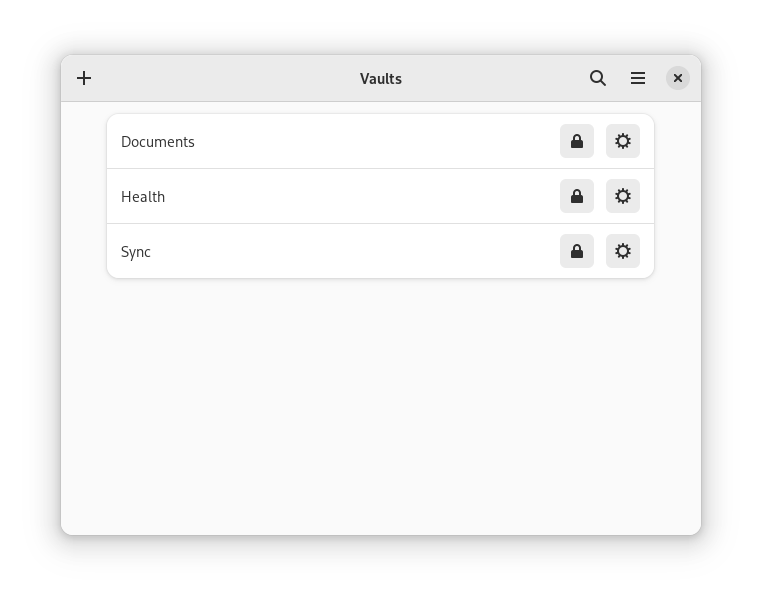

<h1 align="center">
   
  Vaults
</h1>

<strong>Keep important files safe</strong>

 

  

Vaults lets you create encrypted vaults in which you can safely store files.
It currently uses [gocryptfs](https://github.com/rfjakob/gocryptfs) and [CryFS](https://github.com/cryfs/cryfs/) for encryption.  Please always keep a backup of your encrypted files.

This version does not bundle [gocryptfs](https://github.com/rfjakob/gocryptfs) and [CryFS](https://github.com/cryfs/cryfs/) yet, so you need to install them on the host.

# How to build

Open GNOME Builder (or Visual Studio Code with the Flatpak extension), clone the repository, build and run it.

# Translations

Vaults is translated using [Transifex](https://www.transifex.com/mpobaschnig/vaults/).
