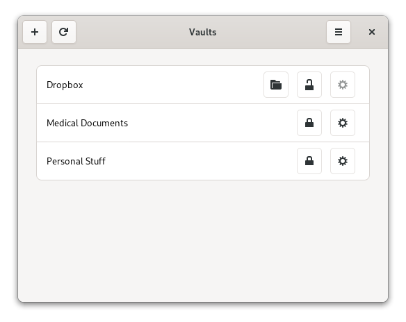

<h1 align="center">
   
  Vaults
</h1>

<strong>An application for creating encrypted vaults for the GNOME desktop.</strong>

 

  

It currently uses [gocryptfs](https://github.com/rfjakob/gocryptfs) and [CryFS](https://github.com/cryfs/cryfs/) for encryption.

Please always keep a backup of your encrypted files.

Note: This is an early release. It should work fine, however, UI might be inconsistent and is about to be polished in following releases.

## Dependencies

Since the Flatpak version is sandboxed, you need following components installed on your system:

- [gocryptfs](https://github.com/rfjakob/gocryptfs)
- [CryFS](https://github.com/cryfs/cryfs/)
- [libfuse](https://github.com/libfuse/libfuse)

## How to build

The simplest way to build Vaults is using GNOME Builder:

- Click `Clone Repository...`
- Enter repository URL
- Press `Clone Project`
- Click run/build button or press `F5`
